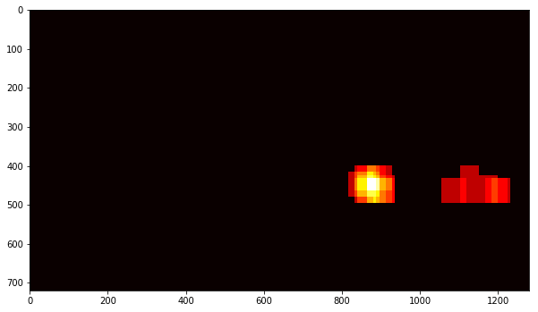
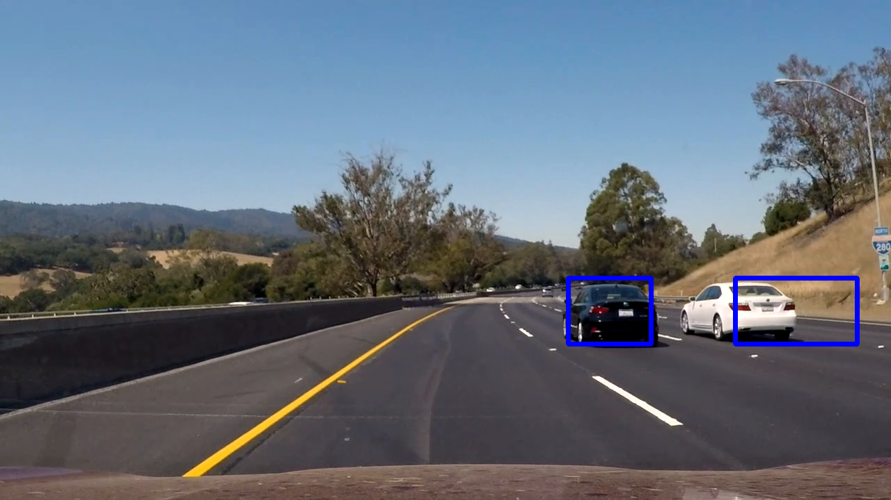

# **Vehicle Detection Project**

The goals / steps of this project are the following:

* Perform a Histogram of Oriented Gradients (HOG) feature extraction on a labeled training set of images and train a classifier Linear SVM classifier
* Optionally, you can also apply a color transform and append binned color features, as well as histograms of color, to your HOG feature vector. 
* Note: for those first two steps don't forget to normalize your features and randomize a selection for training and testing.
* Implement a sliding-window technique and use your trained classifier to search for vehicles in images.
* Run your pipeline on a video stream (start with the test_video.mp4 and later implement on full project_video.mp4) and create a heat map of recurring detections frame by frame to reject outliers and follow detected vehicles.
* Estimate a bounding box for vehicles detected.

[//]: # (Image References)
[image1]: ./examples/car_not_car.png
[image2]: ./examples/HOG_example.jpg
[image3]: ./examples/sliding_windows.jpg
[image4]: ./examples/sliding_window.jpg
[image5]: ./examples/bboxes_and_heat.png
[image6]: ./examples/labels_map.png
[image7]: ./examples/output_bboxes.png
[video1]: ./project_video.mp4

## [Rubric](https://review.udacity.com/#!/rubrics/513/view) Points

Here I will consider the rubric points individually and describe how I addressed each point in my implementation.  

---

### Writeup / README

#### 1. Provide a Writeup / README that includes all the rubric points and how you addressed each one. You can submit your writeup as markdown or pdf.  [Here](https://github.com/udacity/CarND-Vehicle-Detection/blob/master/writeup_template.md) is a template writeup for this project you can use as a guide and a starting point.  

You're reading it!

### Histogram of Oriented Gradients (HOG)

#### 1. Explain how (and identify where in your code) you extracted HOG features from the training images.

The code for this step is contained in the sixth and seventh code cell of the IPython notebook in the `extract_features method.  

First I load all images of vehicles and non-vehicles in memory, using the `load_data` method. The vehicle images were manually separated into training and test data, because it was a dataset with serial images, even using the `train_test_split` method we could face overfitting.

Here is an example of one of each of the `vehicle` and `non-vehicle` classes:


I then explored different color spaces and different `skimage.hog()` parameters (`orientations`, `pixels_per_cell`, and `cells_per_block`).  I grabbed random images from each of the two classes and displayed them to get a feel for what the `skimage.hog()` output looks like.

Here is an example using the `YCrCb` color space and HOG parameters of `orientations=9`, `pixels_per_cell=(8, 8)` and `cells_per_block=(2, 2)`:


#### 2. Explain how you settled on your final choice of HOG parameters.

I set the parameters based on the Udacity lessons and experimentations, and the best parameters were `orientations=9`, `pixels_per_cell=(8, 8)` and `cells_per_block=(2, 2)`

#### 3. Describe how (and identify where in your code) you trained a classifier using your selected HOG features (and color features if you used them).

I trained a linear SVM using the previously loaded images in the `extract_features` method. I've put together the car and non-cars images in a single array. After that I normalized the data using the `sklearn.preprocessing.StandardScaler ()` method and then I used the `LinearSVC` classifier. The implementation that performs the steps described here is in cell 9.

Here is some information about the dataset

```
Number of training car examples = 7033
Number of testing car examples = 1759
Number of training non car examples = 7174
Number of testing non car examples = 1794
```

### Sliding Window Search

#### 1. Describe how (and identify where in your code) you implemented a sliding window search.  How did you decide what scales to search and how much to overlap windows?

I decided to use two search ranges with different scales, one with 1.0 and another with 1.5. The smaller scale has better performance in identifying the cars that are further away, while the larger scale performs better on cars closer to the camera.
The code to find the cars is in cell 12 at the beginning of the section **Find the cars**


#### 2. Show some examples of test images to demonstrate how your pipeline is working.  What did you do to optimize the performance of your classifier?

Ultimately I searched on two scales using YCrCb 3-channel HOG features plus spatially binned color and histograms of color in the feature vector, which provided a nice result.  Here are some example images:


---

### Video Implementation

#### 1. Provide a link to your final video output.  Your pipeline should perform reasonably well on the entire project video (somewhat wobbly or unstable bounding boxes are ok as long as you are identifying the vehicles most of the time with minimal false positives.)
Here's a [link to my video result](./video_output.mp4)

#### 2. Describe how (and identify where in your code) you implemented some kind of filter for false positives and some method for combining overlapping bounding boxes.

First I created a class called `FrameBuffer`, this class stores the positions of positive detections in each frame of the video thus allowing to accumulate the heatmap of n frames to then apply the threshold. The best number I found to accumulate the frames was 10.

So I created another class to store the data of each identified vehicle, called `VehicleTracking`.

The `process_image` method is responsible for receiving each image and process the pipeline. The steps are:

1. use the `find_cars` method with the two scales described above to find the cars
2. add the positions found (box) in the FrameBuffer that return a heatmap if the frame is full
3. if a heatmap is returned by the buffer, the `scipy.ndimage.measurements.label()` method is used to identify individual blobs in the heatmap.
   - for each blob found, we check if there is already a vehicle occupying that area, using the `is_point_intersects` method of the` VehicleTracking` class. If this blob belongs to any vehicle previously identified, this new detection is used to improve the points of the vehicle already identified (see `vehicle.add_fitted` method). If it does not belong to any vehicle, a new instance of `VehicleTracking` is created and added to cars_list, within the buffer.
   - the rectangle at points identified is drawn
4. if no heatmap is found, we tried to use previous detections
   - non-detections are computed, and when that vehicle reaches the maximum number of no detections, it will be removed from cars_list
5. call the pipeline to detect lane lines (`laneline_detection.py file)
6. write in the picture how many cars were detected

Here's an example result showing the heatmap from a series of frames of video, the result of `scipy.ndimage.measurements.label()` and the bounding boxes then overlaid on the last frame of video:

### Here are ten frames predictions that will be used in buffer:


### Here is the output of `scipy.ndimage.measurements.label()` on the integrated heatmap from all ten frames:



### Here the resulting bounding boxes are drawn onto the last frame in the series:



---

### Discussion

#### 1. Briefly discuss any problems / issues you faced in your implementation of this project.  Where will your pipeline likely fail?  What could you do to make it more robust?

I believe that the most critical part of my pipeline is the time it takes to process, every second of the video takes approximately 40 seconds. The next challenge I'd like to solve is to leave the process in real time.

One of the biggest problems I had was avoiding false positives and differentiating one vehicle from the other.
